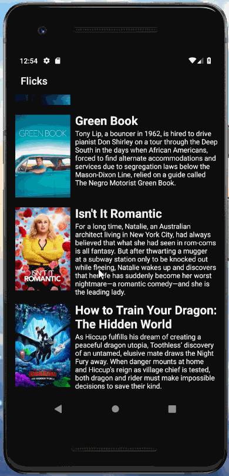

# Project 1 - *Flicks*

**Name of your app** is an android app that allows building a todo list and basic todo items management functionality including adding new items, editing and deleting an existing item.

Submitted by: **Chen Wang**

Time spent: **3** hours spent in total

## User Stories

The following **required** functionality is completed:

* [x] In portrait mode, the poster image, title, and movie overview is shown.
* [x] In landscape mode, the rotated alternate layout should use the backdrop image instead and show the title and movie overview to the right of it.

The following **additional** features are not yet implemented:

* [ ] For popular movies movie voted will be displayed

## Video Walkthrough

Here's a walkthrough of implemented user stories:

GIF created with [LiceCap](http://www.cockos.com/licecap/).

## Notes

Describe any challenges encountered while building the app.

## License

    Copyright [yyyy] [name of copyright owner]

    Licensed under the Apache License, Version 2.0 (the "License");
    you may not use this file except in compliance with the License.
    You may obtain a copy of the License at

        http://www.apache.org/licenses/LICENSE-2.0

    Unless required by applicable law or agreed to in writing, software
    distributed under the License is distributed on an "AS IS" BASIS,
    WITHOUT WARRANTIES OR CONDITIONS OF ANY KIND, either express or implied.
    See the License for the specific language governing permissions and
    limitations under the License.
