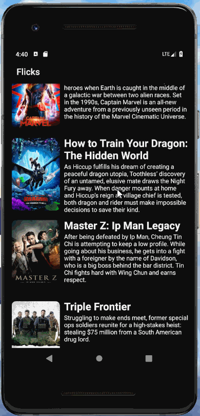

# Project 1 - *Flicks* - week 1

Time spent: **3** hours spent in total

## User Stories

The following **required** functionality is completed:

* [x] In portrait mode, the poster image, title, and movie overview is shown.
* [x] In landscape mode, the rotated alternate layout should use the backdrop image instead and show the title and movie overview to the right of it.

The following **additional** features are not yet implemented:

* [x] For popular movies movie voted will be displayed

# *Flicks* - week 2

### User Stories

#### REQUIRED (10pts)

- [x] (8pts) Expose details of movie (ratings using RatingBar, popularity, and synopsis) in a separate activity.
- [x] (2pts) Allow video posts to be played in full-screen using the YouTubePlayerView.

#### BONUS

- [ ] Trailers for popular movies are played automatically when the movie is selected (1 point).
  - [ ] When clicking on a popular movie (i.e. a movie voted for more than 5 stars) the video should be played immediately.
  - [ ] Less popular videos rely on the detailed page should show an image preview that can initiate playing a YouTube video.
- [ ] Add a play icon overlay to popular movies to indicate that the movie can be played (1 point).
- [ ] Apply the popular ButterKnife annotation library to reduce view boilerplate. (1 point)
- [ ] Add a rounded corners for the images using the Glide transformations. (1 point)

### App Walkthough GIF

### Notes

Describe any challenges encountered while building the app.

## Open-source libraries used
- [Android Async HTTP](https://github.com/loopj/android-async-http) - Simple asynchronous HTTP requests with JSON parsing
- [Glide](https://github.com/bumptech/glide) - Image loading and caching library for Android
    
